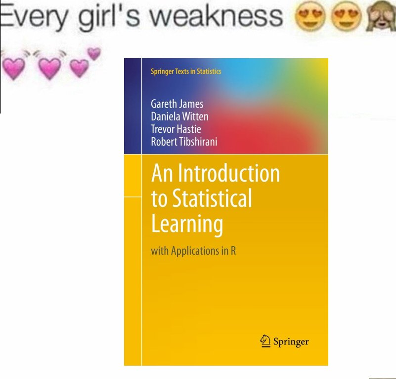

# First Week - Introduction Template
## Template for idea for Intro

# Table of Contents:
+ Abstract
+ Contributor
+ Important Links
+ Languages Known
+ Favorite Songs
+ Favorite Meme

## Abstract
Short intro that you will use for GitHub and inertia7 :)

(Revelant for people who are just creating these things)

Could be quote or anything that describes you.

Example:

*Shrek is love, Shrek is life*

## Contributor 
- Raul 'Ravi' Eulogio 

## Important Links:
+ Linkedin: https://www.linkedin.com/in/raul-eulogio-217069123
+ Email: rauleulogio3 [at] gmail.com
+ GitHub: https://github.com/raviolli77

Any other relevant links you would like to include for us to help us show who you are :)

## Languages Known:

| Language| Level | Language Preference for Project | 
|---------|-------|--------| 
| R 	 | ehh  | ehh    | 
| Python | n00b | fk yes |
| SQL    | GOD  | ehh    | 
| HTML   | n00b | ehh    | 
| scala  | n00b | fk yes |

### Languages/data insight  you want to learn

I want to learn Data vis with JavaScript

## Favorite Songs
Give us your top 5 songs

+ High and Low - Empire of the Sun
+ The Heart pt. 4 - Kendrick Lamar 
+ People I meet - Harrison Fjord 
+ Bass - A$AP Rocky 
+ All Star - Smash Mouth

## Favorite Meme

